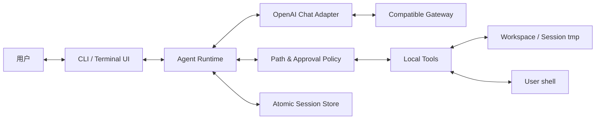
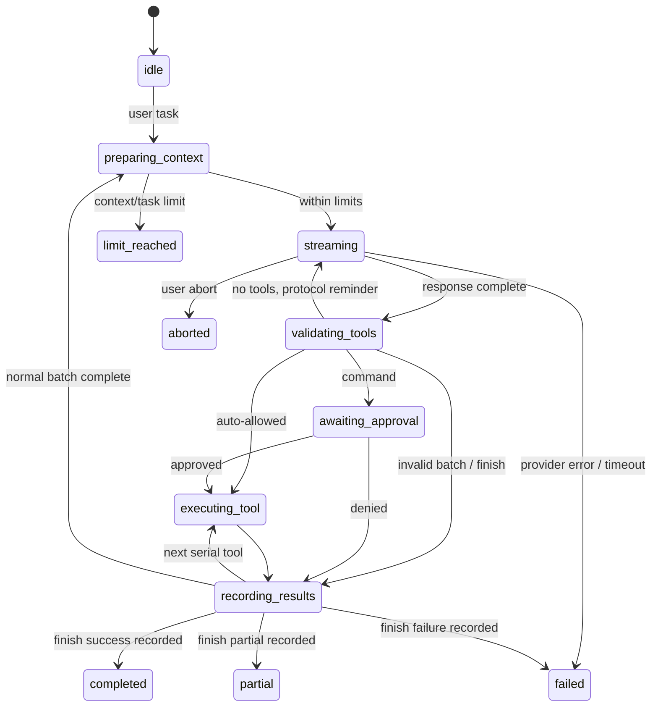

# picode 架构设计

## 1. 架构目标

MVP 只解决五个核心问题：

1. 把 OpenAI-compatible streaming 响应转换为稳定内部结果；
2. 用显式状态机推进和终止 Agent Loop；
3. 验证并串行执行本地工具；
4. 对文件路径和 shell 授权建立诚实的安全边界；
5. 用简单快照恢复会话，而不构建完整生产级审计系统。

系统为单进程、单 Agent、单任务串行执行。模块使用显式接口连接，不引入 Agent 框架或全局事件总线。

## 2. 系统上下文



模型输出和工作区内容都视为不可信输入。文件工具受路径策略限制；经用户批准的 shell 以当前用户权限运行，不属于沙箱。

## 3. 建议目录结构

```text
src/
  cli.ts
  config.ts
  fs-utils.ts
  domain/
    events.ts
    messages.ts
    state.ts
    errors.ts
    tool.ts
  llm/
    provider.ts
    openai-chat-provider.ts
    message-mapper.ts
  agent/
    loop.ts
    limits.ts
    repetition.ts
  context/
    budget.ts
  tools/
    types.ts
    registry.ts
    validators.ts
    list-files.ts
    search-files.ts
    read-file.ts
    write-file.ts
    edit-file.ts
    run-command.ts
    finish.ts
  security/
    path-policy.ts
    approval.ts
    redact.ts
  sessions/
    store.ts
    recovery.ts
  ui/
    terminal.ts
    commands.ts
    renderer.ts
test/
  unit/
  integration/
  fixtures/
```

LLM transport、Agent Loop、工具、安全策略、session store 和 UI 不得混成单一大文件。

## 4. 核心接口

### 4.1 内部消息

项目定义自己的消息类型，不在 Loop 中直接传播 SDK 类型：

- `SystemMessage`
- `UserMessage`
- `AssistantMessage`：完整文本和 tool calls
- `ToolResultMessage`：tool-call ID、工具名和结果

`message-mapper` 是唯一了解 Chat Completions message shape 的模块。

### 4.2 LlmProvider

`LlmProvider` 接收：

- 当前模型消息；
- tool definitions；
- AbortSignal；
- 请求配置。

它实时产生文本 delta，并最终返回：

- 完整 assistant 文本；
- 聚合后的 tool calls；
- finish reason；
- 可选 usage。

生产环境只有 `OpenAIChatProvider`；测试使用 scripted fake provider。该抽象用于隔离 SDK 和测试，不代表支持多个协议。

### 4.3 Tool

每个工具包含：

- 名称、描述和 JSON Schema；
- 本地 validator；
- `execute(context, args, signal)`；
- 标准 `ToolResult`。

`ToolResult.status` 至少支持：

`ok | error | permission_denied | aborted | timeout | interrupted | batch_rejected`

结果包含给模型的简洁文本，并可附带 UI 所需的路径、退出码、耗时和截断信息。

### 4.4 AgentEvent

UI消费以下实时事件：

- `state_changed`
- `assistant_text_delta`
- `assistant_message_completed`
- `llm_usage_received`
- `tool_requested`
- `approval_requested`
- `approval_resolved`
- `tool_completed`
- `context_warning`
- `agent_terminated`

MVP 事件用于模块通信和测试，不单独写 append-only event log。

## 5. OpenAI Chat Adapter

### 5.1 SDK 使用

Adapter 使用官方 `openai` 包、自定义 `baseURL` 和 Chat Completions streaming。优先使用 SDK提供的流式聚合能力获得完整文本、完整 tool arguments、finish reason 和 usage。

如果所选 SDK版本不能同时提供所需聚合结果与 usage，可以在 SDK暴露的 typed chunks 上做最小聚合，但不得自行实现 HTTP 或 SSE 行解析。SDK版本必须锁定并用模拟流测试。

### 5.2 本地校验

SDK完成传输解析后，Adapter/Loop 仍要检查：

- 只消费 choice index 0；
- tool call ID 和名称非空；
- ID 不重复；
- arguments 是可解析对象；
- finish reason 与 tool calls 不矛盾；
- usage 为非负整数或明确缺失。

工具 arguments 必须再通过本地 schema，不能因 SDK或服务端 strict mode 而省略验证。

### 5.3 错误归一化

认证、限流、网络、超时、取消和协议格式错误映射为稳定的项目错误类型。远端错误正文在展示和保存前先做 API Key 脱敏。

## 6. Agent Runtime

### 6.1 状态机



Runtime 是唯一可以修改 Agent 状态的模块。终态结束当前用户任务；交互式 CLI 可以在下一条 user message 时创建新的任务段。

### 6.2 一轮执行顺序

1. 保存 user message 和安全快照。
2. 检查请求数、活跃时间和上下文预算。
3. 发起 LLM streaming，UI实时显示文本。
4. 收到完整 response 后保存 assistant message 和 usage。
5. 预验证整个 tool-call 批次。
6. 合法批次逐个执行；命令先审批。
7. 每个工具执行前保存 pending marker，结束后保存结果并清除 marker。
8. 补齐所有 tool result message 后进入下一轮或任务终态。

这不是数据库事务，文件和命令副作用无法回滚。快照只用于避免自动重放，不声称精确还原崩溃瞬间。

### 6.3 批次预验证

执行任何工具前检查：

- ID 唯一且非空；
- 工具存在；
- arguments 通过本地 schema；
- `finish` 是唯一调用；
- 未触发第三次重复调用；
- 当前任务仍在限制内。

任何调用失败时整批不执行。错误调用得到具体错误，其他调用得到 `batch_rejected`，并为所有 ID 生成结果，从而避免部分副作用和无配对历史。

合法 `finish` 生成 `accepted` result 并保存，然后进入对应终态。`status` 是必填字段，其余说明字段可以省略，由运行时规范化默认值。

### 6.4 限制计数

每个任务维护：

- `llmRequestCount`
- `activeElapsedMs`
- `consecutiveToolErrors`
- `consecutiveNoFinishTurns`
- 最近规范化 tool signature 及重复次数

tool signature 是工具名加稳定排序后的参数序列化。第三次完全相同的连续调用在执行前终止。等待审批通过 monotonic clock pause/resume 排除在活跃时间外。

## 7. 工具与安全

### 7.1 PathPolicy

PathPolicy 只允许：

- canonical workspace root；
- 当前 session 的 `/tmp/picode-<session-id>/`。

现有目标使用 `realpath`。新目标先找到最近存在的父目录并解析真实路径，再检查剩余目标。路径比较按分段语义进行；写入前再次检查，防止普通 `..`、相似前缀和符号链接逃逸。

MVP 不支持工作区外文件工具审批。用户若确有需要，只能主动批准一条 shell 命令，并承担其当前用户权限风险。

### 7.2 Protected files

list/search/read/write/edit 执行器必须拒绝 `.env` 和 `.env.*`，仅 `.env.example` 例外。该限制必须在执行层实现，不能只靠 UI 隐藏。

配置模块只提取六个 `PICODE_*` 键，并提供模型、上下文窗口、单次输出长度和任务请求上限的默认值；redactor 在 UI、错误和 session 保存前替换实际 API Key。递归 JSON 脱敏只处理值并保留对象键名，避免破坏工具参数名。

### 7.3 ApprovalBroker

工具不直接读终端。`run_command` 向 `ApprovalBroker` 提交完整命令、cwd、超时和通用风险说明。CLI broker询问用户；`ScriptedApprovalBroker` 返回预设决定。

每次审批仅覆盖当前调用。non-TTY 环境默认拒绝。

### 7.4 Shell runner

Shell runner 使用 child process、AbortSignal、60 秒 timeout 和独立 stdout/stderr 捕获。大输出保存在 session tmp，模型只收到尾部摘要。

MVP 只可用少量明显关键词追加“可能访问网络”的提示，不构建 shell parser 或多级风险系统。所有命令无论风险标签都必须审批。

子进程环境从运行所需基础环境构造，并显式移除 `PICODE_API_KEY`。审批后的命令仍可读取文件系统、访问网络或修改工作区外内容，因此不是沙箱。

## 8. Context Budget

MVP 不实现自动 compaction，避免引入摘要正确性和恢复语义。

`BudgetTracker` 保存最近一次 `usage.prompt_tokens`。下一请求前仅估算该响应后新增的 user、assistant 和 tool result 内容：

- 估计达到配置窗口 75%：发出 UI warning；
- 达到 90%：拒绝新请求并进入 `limit_reached`；
- usage 缺失：对完整当前 context 做一次保守字符估算并警告。

估算器包含固定消息/tool schema 开销，但不声称是 tokenizer。这个模块以后可以扩展为 usage anchor + automatic compaction，而无需修改 Agent Loop 的主要边界。

## 9. Session Store

### 9.1 布局

```text
~/.picode/projects/<workspace-hash>/
  project.json
  sessions/
    <session-id>.json
```

workspace hash 基于 canonical path 的 SHA-256。session JSON保存元数据、模型消息、usage、任务状态、限制计数和可选 pending tool。

### 9.2 原子写入

Session Store 和文件/artifact 写入共用 `fs-utils.ts` 的同目录临时文件 + rename 原子替换 helper。文件尽量设置为仅当前用户可读写。保存前执行 secret redaction，artifact 文件名由程序生成。

### 9.3 基本恢复

启动时加载最近会话或由用户 `/resume` 指定会话。损坏 JSON 明确报错，不静默丢弃消息。

若发现 pending tool：

1. 标记上一任务被中断；
2. 显示工具名和“副作用状态未知”；
3. 不自动执行该工具；
4. 用户可以继续会话并要求 Agent检查当前文件/测试，也可以 `/new`。

MVP 不通过事件日志精确重建 tool-call/result，不承诺从任意写入点无损恢复。

## 10. CLI/TUI

使用 Node `readline` 和独立的 `TerminalRenderer`。UI只负责：

- 参数和 slash command 解析；
- 把 `AgentEvent` 渲染为可区分的终端区块；
- 命令审批；
- Ctrl+C 转换为 AbortSignal；
- session、usage warning 和终态展示。

`TerminalRenderer` 不改变 Agent 状态或执行工具。assistant 流式文本以独立区块输出；工具调用、工具结果、审批、usage、warning 和终态使用不同标签、间距和语义颜色。颜色只在 TTY 中启用，非 TTY 输出不包含 ANSI 控制序列，便于日志和管道消费。工具参数和结果摘要在展示层截断，避免单条输出占满终端。

UI不直接执行工具、修改 model context 或写 session。Agent busy 时拒绝新的普通输入；审批输入由 Approval Broker独占，避免与主 prompt 竞争 stdin。

## 11. 测试边界

以下接口必须可替换：

- `LlmProvider` → scripted fake；
- `ApprovalBroker` → allow/deny fake；
- `Clock` → fake monotonic clock；
- session root → 临时目录；
- shell runner → 单元 fake，集成测试使用安全真实命令。

测试层次：

- Unit：配置、mapper、validator、path policy、budget、limits。
- Integration：fake provider + real Loop + 临时文件系统。
- Process/CLI：spawn 构建后的 CLI，检查参数、交互和退出码。
- Live E2E：本地 tarball 安装到仓库外 demo，通过真实网关执行。

生产依赖只在 `cli.ts` 组合。Loop 不直接 import OpenAI client、readline 或真实 home 路径。

## 12. 关键决策

### SDK负责传输，不负责 Agent

官方 SDK减少 HTTP/SSE 兼容工作；本项目保留 Loop、校验、工具和审批，满足题目要求。

### 显式 `finish`

普通停止无法区分任务成功、模型放弃和协议异常。`finish` 提供可测试的结果状态；固定 system prompt 要求模型在普通问答中也在同一响应调用 `finish`，从而避免为简单回答额外循环。

### 串行批次与整批预验证

串行执行降低文件冲突；整批预验证避免“前半批已写文件、后半批才发现参数错误”。

### 基本快照而非事件溯源

原子快照足以支持教学项目的多会话与安全恢复。完整 event sourcing 的成本和测试面不适合当前截止时间。

### 上下文保护而非自动压缩

演示模型具有很长上下文，MVP 先记录 usage 并阻止明显超限。自动摘要的质量和恢复复杂度留给后续增强。

## 13. 已知局限

- compatible 网关可能和官方 SDK存在细节差异，需要真实 smoke test。
- shell 审批不能阻止用户误批危险命令。
- 路径检查不对抗恶意本地并发进程造成的全部 TOCTOU 竞态。
- 字符估算不是 tokenizer，MVP 也不会自动压缩长会话。
- 崩溃恢复只识别 pending 副作用，不重建完整事件历史。

## 14. 外部协议依据

Chat Completions API定义了 `tools/tool_calls`、JSON Schema 参数和 `stream_options.include_usage`；文档同时要求调用方验证模型生成的工具参数：

- <https://developers.openai.com/api/reference/resources/chat/subresources/completions/methods/create>
